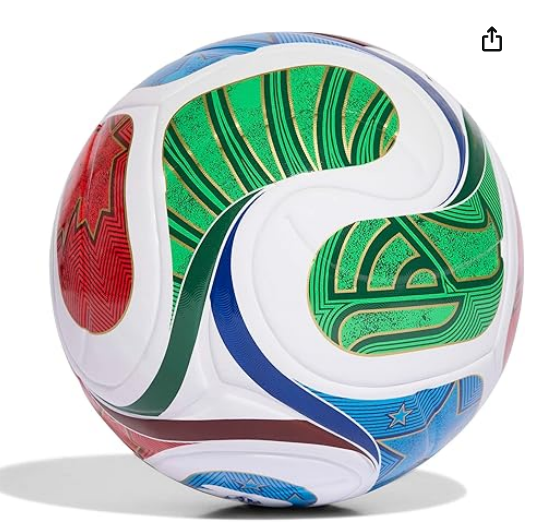
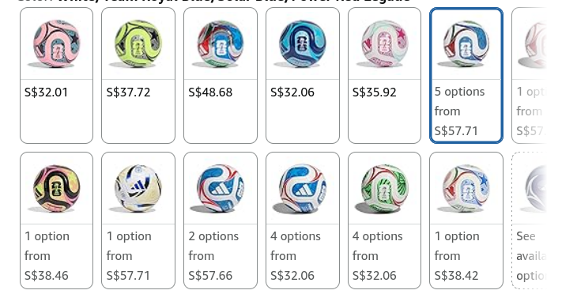

- Inspired by the iconic "la ola" wave among the crowd, the adidas FIFA 
  World Cup 26 Trionda League Soccer Ball features a seamless TSBE surface
   for precise touch and reduced water uptake. A butyl bladder ensures 
  shape retention.
- TSBE TECHNOLOGY: Seamless surface for better touch and lower water uptake
- KEEPS ITS SHAPE: Butyl bladder for best air retention
- REQUIRES INFLATION: Ships flat, pump not included
- FIFA QUALITY AND OFFICIALLY LICENSED: Officially licensed by FIFA, the 
  ball passed FIFA tests on circumference, weight, rebound and water 
  absorption

<!--more-->

Step onto the pitch with confidence using
 this durable training ball, designed for players who demand excellence 
in every touch. Whether you're honing your skills during rigorous 
practice sessions or competing in high-stakes matches, this soccer ball 
brings high-level performance to your game. Engineered with a laminated 
TPU surface, this training soccer ball offers a durable, seamless 
exterior that delivers consistent touch and responsive feel. The 
textured finish with strategically placed debossing enhances precision 
and flight stability, ensuring accurate passes and powerful strikes. As a
 quality-certified soccer ball, it passes rigorous tests for weight, 
circumference, rebound, and water absorption, making it ideal for 
serious players and club teams. The butyl bladder provides superior air 
retention, keeping your ball properly inflated through extended play. 
From backyard kickabouts to competitive league matches, this adidas 
soccer ball blends innovation with durability, giving you a reliable 
training partner that performs when it matters most.
